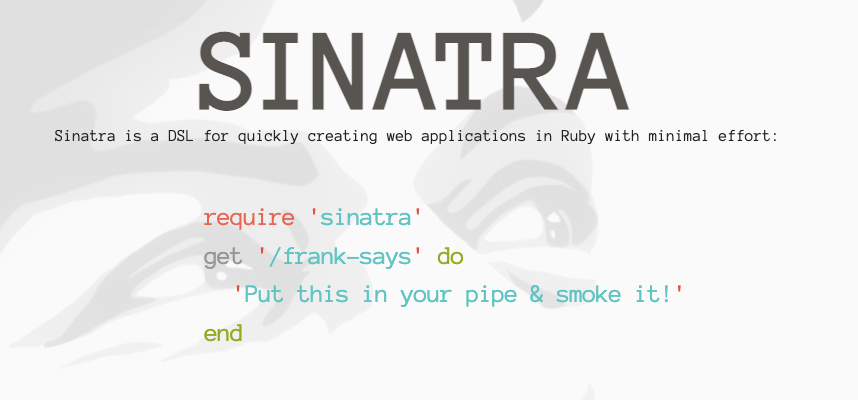
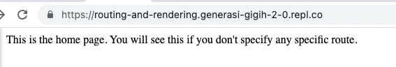
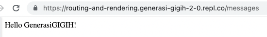
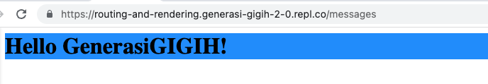
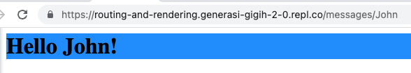
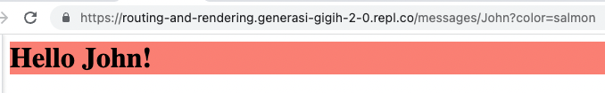
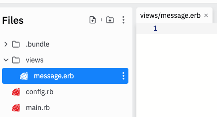
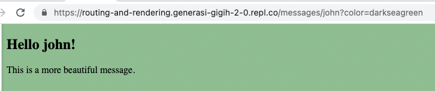
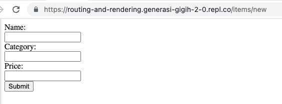
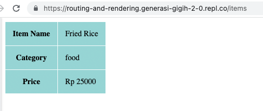

# Routing

When we visit a web page, click on a link, submit some form, we are making an HTTP request via web browser to a specific address. The client, in this case web browser, send that request to the application server. How does the application server know what to do, which page to render, what data to process, etc based on the request sent?

When there's an HTTP request from the client to the server, it will go via a *router* that will dispatch the request to the right controllers or handlers. Think of a router as a phone operator who can connect you to the right person to talk to.

The router will recognize each address when they conform to certain rules or patterns. 

> REST is a software architectural style that defines the set of rules to be used for creating web services. Web services which follow the REST architectural style are known as RESTful web services. It allows requesting systems to access and manipulate web resources by using a uniform and predefined set of rules.

There are other styles, like gRPC or graphQL, but in this course we will focus on REST-styled interface routing.

REST routing consists of two parts:

1. Resource, or object, represented by URL/path
2. Action, the verb, represented by HTTP method

## URL (Uniform Resource Locator)
URL, or commonly referred as web address/path. In REST, URL is commonly used to refer some resources or objects in our application. It can be `orders`, `restaurants`, `posts`, `jobs`, etc.

REST URL examples:
* `/orders` (Represent all orders)
* `/orders/123` (Represent order with id `123`)
* `/restaurants/17/menus` (Represent all menus in restaurant with id `17`)

## HTTP Methods
With REST, you can imagine HTTP method as a verb (action) applied to the object (based on URL). It’s because the method is a literal verb.

Officially there are multiple methods such as GET, PUT, POST, DELETE, HEAD, OPTIONS, CONNECT, PATCH, and TRACE.

Most of the time we only care about `POST`, `GET`, `PUT`, `DELETE` which represent CRUD (Create, Read, Update, Delete) action you learn from previous module.

## REST API Routing
Combining URL and HTTP method will give you REST API routing.
* `GET /restaurants` Read all restaurants
* `POST /restaurants` Create a restaurant
* `PUT /restaurants/13` Update restaurant with id 13`
* `DELETE /restaurants/13/menus/2` Delete menu with id 2 from restaurant with id 13

## Sinatra Ruby
Now let's practice the routing with some simple code. We are going to use **Sinatra** to help us practice creating a RESTful web service. [Sinatra](http://sinatrarb.com/) is a minimalist Ruby framework for building server-side web applications.

Sinatra might not be as popular or as high-powered as [Rails](https://rubyonrails.org/), another Ruby framework. But Sinatra is a more helpful tool for learning, since we will have to do most of the things like routing, connecting to database, etc manually. Rails will handle most of the things under the hood via its "magic", which means Rails isn't as helpful for understanding this essential concept. 

With Sinatra, we will have just enough framework to set up our application quickly, but not too much so we can *create* our own magic.

To start, let's install `sinatra` gem from your `Shell` tab
```sh
gem install sinatra
```
On your `main.rb` add the following lines to be able to use Sinatra for your app.

```ruby 
require 'sinatra'
require_relative 'config'
```

> **Note**: If you run Sinatra on your local machine, you don't need to import custom config on the second line.
> This line will import the `config.rb` file that contains [custom configuration for Replit environment](https://docs.replit.com/hosting/deploying-http-servers).

---
Let’s create basic `get` request to read messages. 
```ruby
require 'sinatra'
require_relative 'config'

get '/' do
  'This is the home page. You will see this if you don\'t specify any specific route.'
end

get '/messages' do
  'Hello GenerasiGIGIH!'
end
```

Run it by clicking `Run` button on the top of the page, or by typing `ruby main.rb` on the `Shell` tab and press enter. A browser page will be opened inside this Replit. If you see some error page, try to open a new tab and copy-paste the URL. 

The URL generated from Replit usually goes like: 
* `https://<name-of-the-repl-user-name>.<team-name>.repl.co` 
* So if your username is `john-doe`, it will be
  - `https://routing-and-rendering-john-doe.generasi-gigih-2-0.repl.co`


You should be able to see something like this on your browser!


Now add `/messages` at the end of the URL, you will be directed to your second page.


> **Note**: If you run `ruby main.rb` on your local without custom `config`, default Sinatra port is `4567`. So you will be able to see your page at `http://localhost:4567`

## Get request with HTML format
Looks like our webpage is dull, we should add some color!

Remember how to add background using `html` and `css`?

Let’s beautify our hello world by adding html tag and style
```ruby
require 'sinatra'
require_relative 'config'

get '/' do
  'This is the home page. You will see this if you don\'t specify any specific route.'
end

get '/messages' do
 "<h1 style=\"background-color:DodgerBlue;\">Hello GenerasiGIGIH!</h1>"
end
```
Stop the running server 
* If you run it with `Run` button, then simply click `Stop` button.
* If you run it via Shell tab with `ruby main.rb` command, press `ctrl+c` to stop it
And run it again to see the changes applied to your page! 

> Note: you need to restart the server every time you make changes to your code

Refresh the web page and see some color on it.


## Route params
Hmm, hello world is not really interesting, right?

What if we want it to be greeted by our name instead?

The current message content is static, let’s make it respond to our name.

```ruby
require 'sinatra'
require_relative 'config'

get '/' do
  'This is the home page. You will see this if you don\'t specify any specific route.'
end

get '/messages/:name' do
 name = params['name']
 "<h1 style=\"background-color:DodgerBlue;\">Hello #{name}!</h1>"
end
```

Restart the ruby program, then access `https://<your URL domain>/messages/<your name>`

E.g. `https://routing-and-rendering.generasi-gigih-2-0.repl.co/messages/John`


## Multiple routing
If we try to access our previous url `https://<your URL domain>/messages`, it shows an error page!

It’s because we update the existing routing to `/messages/:name`.

Since we want to keep both routing, let's write both route.

```ruby
require 'sinatra'
require_relative 'config'

get '/' do
  'This is the home page. You will see this if you don\'t specify any specific route.'
end

get '/messages' do
 "<h1 style=\"background-color:DodgerBlue;\">Hello world!</h1>"
end

get '/messages/:name' do
 name = params['name']
 "<h1 style=\"background-color:DodgerBlue;\">Hello #{name}!</h1>"
end
```

## Query params
What if we want to also dynamically change the color? Should we add new route param? `/messages/:name/:color`

But what would happen if we have more parameters to add? We will have to define a lot of multiple routes. It is simply not efficient.

Here, we can utilize what we call `query params`. Let's try that to send our color specification.

```ruby
# ... (only showing relevant part of code)
get '/messages/:name' do
  name = params['name']
  color = params['color'] ? params['color'] : 'DodgerBlue'
    "<h1 style=\"background-color:#{color};\">Hello #{name}!</h1>"
end
```
We’re using color parameter to tweak the text background, which default to `DodgerBlue` if not specified.

Let’s try accessing it.



## ERB template
Adding background on our one-line text doesn’t really make our web beautiful. We need to add more robust `html` tags and `css`. Rendering using string is no longer desirable for complex UI.

Instead of putting the `html` in a string, it would be better to put the template in different file. This snippet of code show that there will be an ERB template with the name of `message` and we can pass variable color and name. 

This message template should be put in `./views/message.erb`.

So go ahead click on `Add folder` button on your left, name it `views`, and  `Add file` inside it with name `message.erb`


What does the ERB template look like?

It contains the html tag and style, with erb style variable parameter <%= var %>
```html
<!DOCTYPE html>
<html>
  <body style="background-color:<%= color %>;">
    <h2>Hello <%= name %>!</h2>

    <p>This is a more beautiful message.</p>
  </body>
</html>
```

Now let's use it on one of our routes. You can remove the HTML bit `"<h1 style=\"background-color:#{color};\">Hello #{name}!</h1>"` and replace it with some lines to use the ERB template.

```ruby
# ... (only showing relevant part of code)
get '/messages/:name' do
  name = params['name']
  color = params['color'] ? params['color'] : 'DodgerBlue'
  erb :message, locals: {
    name: name,
    color: color
  }
end
```


Remember our route on `/messages`?

We can use the same template to render that route so we have a consistent format.

```ruby
# ... (only showing relevant part of code)
get '/messages' do
  erb :message, locals: {
    name: 'GenerasiGIGIH',
    color: 'DodgerBlue'
  }
end
# ...
```

## GET vs POST
Yay! We got to make our web accessible by routing and able to make it beautiful using template. But so far, we're only trying `GET` requests, when do we need other methods such as `POST`?

| | GET | POST |
|--|
| History | Parameters remain in browser history | Parameters are not saved in browser history |
|Restrictions on data length| Yes, when sending data, the GET method adds the data to the URL; and the length of a URL is limited (maximum URL length is 2048 characters)|No restrictions|
|Restrictions on data type|Only ASCII characters allowed|No restrictions. Binary data is also allowed|
|Security|GET is less secure compared to POST because data sent is part of the URL. Never use GET when sending passwords or other sensitive information!| POST is a little safer than GET because the parameters are not stored in browser history or in web server logs|
|Visibility| Data is visible to everyone in the URL|Data is not displayed in the URL|

## Create post route with body params
Let’s create a post login route. It will accept username and password then success only if username and password are `admin`.
On your `main.rb`, add 2 routes. The first one `get /login` is used to render the login form. And the second one `post /login` is used as the action on the login form.

```ruby
# ... (only showing relevant part of code)
get '/login' do 
  erb :login
end

post '/login' do
  if params['username'] == 'admin' && params['password'] == 'admin'
    return 'Logged in!'
  else
    redirect '/login'
  end
end
```
We also use `params` to access post data that is sent via `body params`. `redirect` is used to send user to another route, in this case back to login form (get).

Now let's add one more ERB file on `./views/login.erb` for our login form page.
```html
<form action="/login" method="POST">
  <label for="username"> Username:</label><br>
  <input type="text" id="username" name="username"><br>

  <label for="password"> Password:</label><br>
  <input type="password" id="password" name="password"><br>

  <input type="submit" value="Submit">
</form>
```

Restart your server and try to go to your `/login` page!


## Homework
1. Create a new route, along with the page containing a form to create item with fields: name, category, price. Input price with only number. 


2. Create another route for submitting the data, and showing another page with the item details. 

3. Bonus: use some table and colors to make the page pretty.
